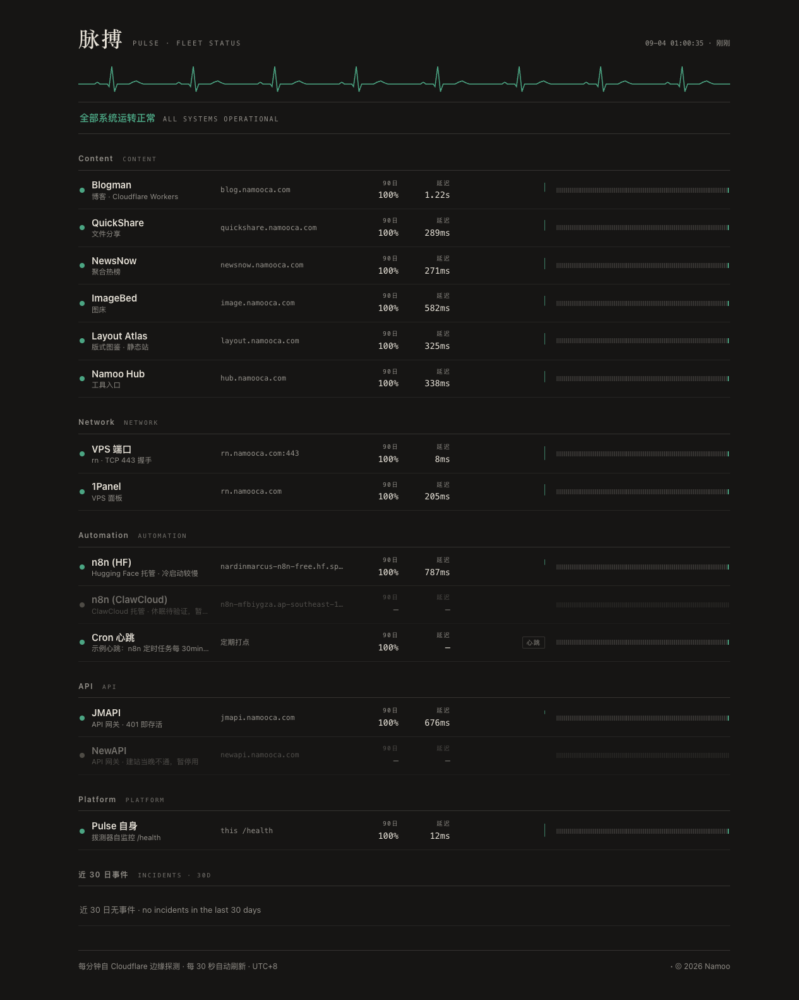
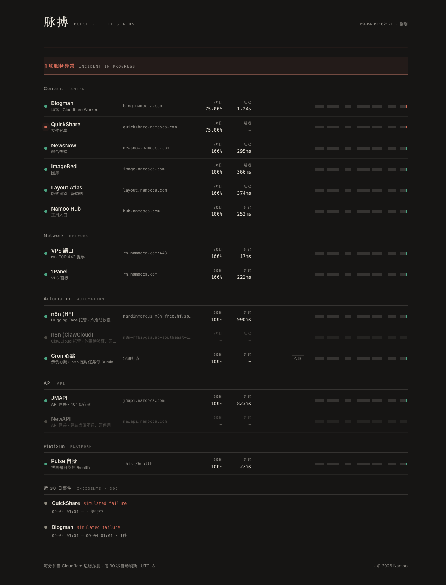
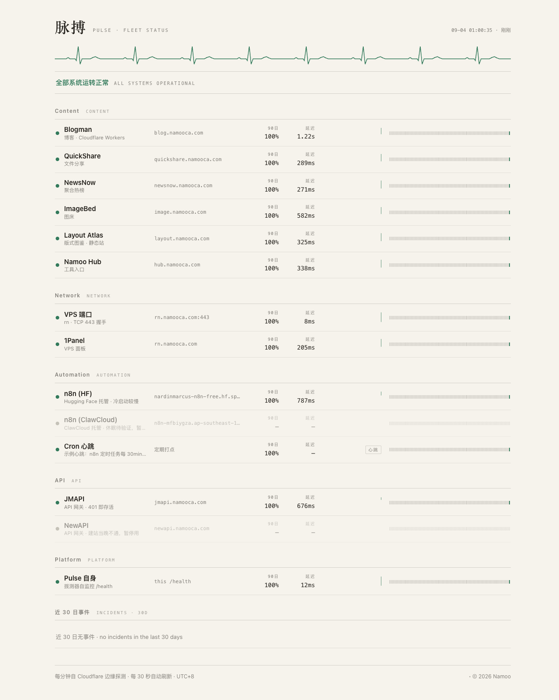

<div align="center">

# 脉搏 · Pulse

**An edge-native status page & uptime monitor for your whole fleet — one Worker, zero external resources.**

为自托管舰队而生的边缘状态页：每分钟拨测、故障时间线、心跳通知，全部跑在一个 Cloudflare Worker 里。

[](https://workers.cloudflare.com)
[](https://pulse.namooca.com)

[English](README.md) · [简体中文](README.zh-CN.md)



</div>

---

Pulse watches a fleet of self-hosted services the way the fleet deserves: **checks-as-code**, probed every minute from Cloudflare's edge, with a public status page that stays readable at 4am. State lives in a Durable Object's built-in SQLite — no D1, no KV, no external database. One `wrangler deploy` ships the prober, the storage, the scheduler and the page.

The scheduling is self-healing: each tick arms the next Durable Object alarm 60 seconds out, so the heartbeat chain sustains itself even if cron triggers go silent. A registered cron fires in parallel as redundancy; a 45s dedup window keeps the two lanes honest.



## Features

- **Four check types** — `http` (status codes, keyword, redirect policy), `tcp` (socket handshake via `connect()`), `push` (reverse heartbeat: the target pings `/push/<token>`, stale after 2× interval), `self` (Pulse watches itself)
- **Honest states** — a single failed probe flips a check to `down` immediately; the *incident* (and the notification) only opens on the 2nd consecutive failure, filtering single flaps. Recovery auto-closes the incident and notifies with the outage duration
- **Public status page** — SSR, bilingual (中文/EN), paper-and-ink theme with a hand-drawn ECG line as the only decoration; flatlines red during incidents; auto-refreshes by swapping `<body>` every 30s; zero frameworks, works without JS
- **90-day day-strip & 24h latency sparkline** per check; hourly rollup buckets keep queries cheap while raw samples retain 48h; everything computed in UTC+8
- **Notifications** — generic webhook (n8n-ready payload) and Telegram Bot, both optional; incident open + recovery
- **Badges** — `GET /badge/<slug>.svg` (status) and `/badge/<slug>/uptime.svg` (90-day uptime), shields-flat style, 5-min cache
- **Admin** — token-gated page at `/admin`: pause/resume, live test-run, manual tick, push tokens
- **Local-first ops** — nothing to babysit; storage rolls itself over (samples 48h, buckets 365d, incidents 180d)

## Quick start

Requires Node ≥ 20.

```bash
git clone https://github.com/nardinmarcus/pulse.git
cd pulse
npm install
cp .dev.vars.example .dev.vars
npm run dev        # http://localhost:8791
```

Edit [`src/checks.js`](src/checks.js) — the single config surface — then deploy:

```bash
npx wrangler deploy                                  # worker + custom domain + triggers
npx wrangler secret put ADMIN_TOKEN                  # enables /admin
```

Optional secrets: `NOTIFY_WEBHOOK_URL`, `TELEGRAM_BOT_TOKEN`, `TELEGRAM_CHAT_ID`, `PUBLIC_URL`.

## The check config

```js
// src/checks.js
{
  slug: 'blogman', name: 'Blogman', grp: 'Content',
  type: 'http', target: 'https://blog.namooca.com',
  method: 'HEAD', interval: 60,        // seconds; also timeout, accept[], keyword, follow_redirects
  note: '博客 · Cloudflare Workers',
},
{ slug: 'vps-tcp', type: 'tcp',  target: 'rn.namooca.com:443', interval: 60 },
{ slug: 'cron-job', type: 'push', interval: 1800 },  // n8n pings /push/<token> every 30min
```

Disabled checks ship as `enabled: 0` — shown grey on the page, probed never. `wrangler dev` helpers (gated by `PULSE_DEV=1`): simulate the next probe result or backdate a heartbeat, so failure paths are demoable and testable.

## API

| Route | What |
|---|---|
| `GET /` | status page (SSR HTML) |
| `GET /api/status` | full snapshot JSON (checks, series, incidents) |
| `GET /health` | liveness for the self-check |
| `GET /badge/<slug>.svg` · `/badge/<slug>/uptime.svg` | shields-flat badges |
| `POST /push/<token>` | heartbeat ping (GET works too) |
| `POST /admin/api/*` | `list` · `tick` · `check/<slug>/pause|resume|test` · `push-tokens` — `Authorization: Bearer <ADMIN_TOKEN>` |

## How state is kept

```text
probe ──► samples (48h) ──► hourly buckets (365d) ──► 90-day strip · uptime %
        └─► state machine ──► incidents (auto open @2nd fail, auto close) ──► notifications
```

Single-writer Durable Object (`PulseCore`) owns schema, config sync, probing, the state machine, rollups and notifications. Page, API and badges all read a 20-second in-memory snapshot.

## Verification

```bash
npm test          # 35 unit tests — state machine, rollups, svg, notifications
npm run smoke     # boots wrangler dev, drives ticks, asserts 28 behaviours end-to-end
```

## Notes

- [CONTEXT.md](CONTEXT.md) is the domain vocabulary (Chinese), [DESIGN.md](DESIGN.md) the visual spec — same conventions as the rest of this fleet.
- Free-plan friendly: cron + alarm invocations, DO request/storage and subrequest volumes all sit an order of magnitude under limits for a ~15-check fleet.
- © 2026 Namoo · [中文文档](README.zh-CN.md)

<div align="center">



</div>
